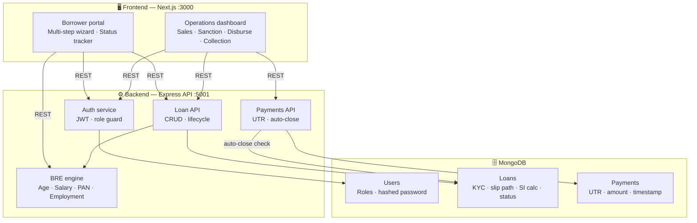
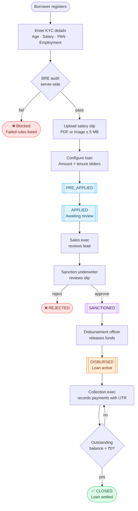
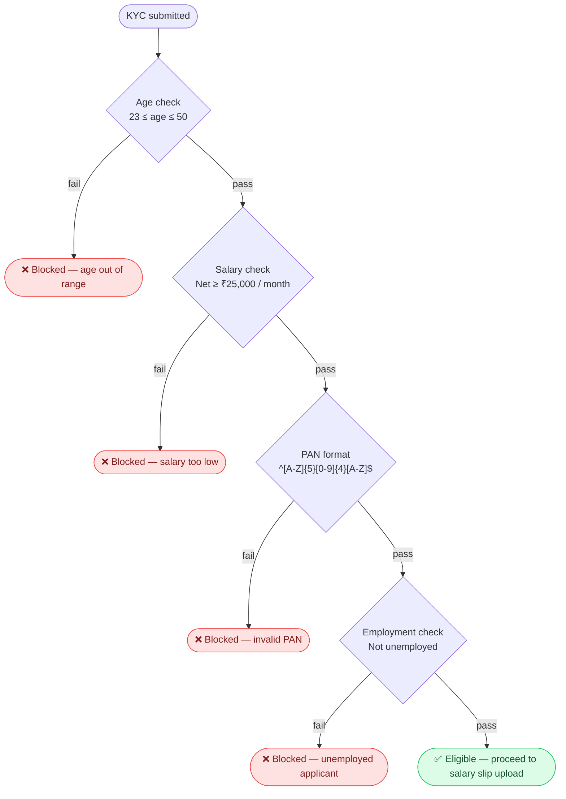

# LendFlow | Loan Management System

LendFlow is a modern, high-end, production-grade **Loan Management System (LMS)** built as a CreditSea technical assignment. 

It provides an end-to-end sandbox representing a lending platform where borrowers can register, fill details, undergo an instant Business Rule Engine (BRE) eligibility audit, upload income slips, select custom sliders for loan calculations, and track approval processes. Simultaneously, an **Operations Dashboard** gives internal executives (Sales, Sanction, Disbursement, and Collection) role-based views to guide applications through their respective lifecycles.

---


## 📊 System Visualizations & Diagrams

Below are the architectural and lifecycle flows designed for the LendFlow platform (configured locally):

### 1. System Architecture Flow


### 2. End-to-End Loan Lifecycle


### 3. Business Rule Engine (BRE) Eligibility Flow

---

## 🔑 Sandbox Tester Credentials

A database seed script automatically prepares pre-created accounts for all roles with dummy loans in various stages. 

To test, log in using **`Password123`** as the password for all profiles:

| Account Type / Role | Sandbox Email | Target Dashboard Module / View |
| :--- | :--- | :--- |
| **System Administrator** | `admin@lendflow.com` | Access **ALL** modules (Sales, Sanction, Disburse, Collection) |
| **Sales Executive** | `sales@lendflow.com` | Lead tracking (registered borrowers in pre-application stages) |
| **Sanction Underwriter** | `sanction@lendflow.com` | Approve or Decline applied loans (review salary slips) |
| **Disbursement Officer** | `disbursement@lendflow.com` | Release funds for approved/sanctioned applications |
| **Collection Executive** | `collection@lendflow.com` | Repayment ledger (record payments with UTR, auto-close check) |
| **Borrower (Pending)** | `borrower2@lendflow.com` | Pre-applied loan in **APPLIED** stage (review-pending tracker) |
| **Borrower (Active)** | `borrower4@lendflow.com` | Active loan in **DISBURSED** stage (in-repayment tracker) |

---

## 🚶‍♂️ Evaluator Testing Walkthrough (Test in 2 Minutes!)

To experience the complete loan lifecycle from **Request ➔ Approval ➔ Disbursement ➔ Repayment Settlement**, follow this step-by-step walkthrough:

### Step 1: Create a Borrower Application
1. Open **[http://localhost:3000](http://localhost:3000)** and go to **Sign In**.
2. Register a new account (e.g. `alex@lendflow.com`) or log in as a borrower.
3. On **Step 2 (Eligibility)**, enter KYC details:
   - DOB: `1995-05-10` (Age must be 23–50)
   - Salary: `₹45,000` (Salary must be ₹25,000+)
   - PAN: `ABCDE1234F` (Alphanumeric regex checked)
   - Employment: `Salaried`
   - *Note: If you enter invalid inputs (e.g., Unemployed or ₹15k salary), the Business Rule Engine (BRE) alert will instantly block you and list the exact failed rules!*
4. Click **Validate**. Watch the live rule scanning audit animation pass and advance.
5. On **Step 3 (Salary Slip)**, drag and drop any test image/PDF (Max 5MB) and upload it.
6. On **Step 4 (Configure)**, use the sliders to select **₹2,50,000** for **180 Days**. The live panel will instantly calculate the 12% p.a. simple interest. Click **Submit**.
7. The portal switches to the **Approval Status** screen showing your loan as **`APPLIED`** (Pending Review). Log out.

### Step 2: Underwrite & Sanction the Loan
1. Go to the Sign In page and click the **Sanction** profile from the Sandbox Panel (fills `sanction@lendflow.com` / `Password123` instantly).
2. In your queue, you will see `alex@lendflow.com`'s application.
3. Click **"View / Download Salary Slip"** to verify their income proof.
4. Click **Approve & Sanction**. The loan status updates to `SANCTIONED`! Log out.

### Step 3: Disburse the Funds
1. Click the **Disbursement** profile from the Sandbox Panel (fills `disbursement@lendflow.com` / `Password123`).
2. In your **Disbursement Queue** tab, you will see the sanctioned loan waiting.
3. Click **Release Funds**. The loan is dispatched, status updates to `DISBURSED`, and is now active! Log out.

### Step 4: Record Payments & Auto-Close
1. Click the **Collection** profile from the Sandbox Panel (fills `collection@lendflow.com` / `Password123`).
2. In the **Collections Ledger**, you will see the active loan showing outstanding dues.
3. Click **Record Payment**.
4. Type in a unique transaction code (e.g. `UTR990088`) and log a partial payment of `₹1,00,000`. The outstanding balance decreases instantly!
5. Log a final payment for the remaining balance. **Once the outstanding dues drop to ₹0, the system automatically transitions the loan status to `CLOSED`.**
6. Log back in as your borrower (`alex@lendflow.com`). The status tracker immediately refreshes to a clean, settled state reading: **"Loan Closed & Settled - No outstanding dues!"**

---

## 🚀 Running the Project Locally

### 1. Prerequisites
- **Node.js** (v20 or higher is recommended).
- **MongoDB** running locally (`mongodb://127.0.0.1:27017/lendflow`) or access to MongoDB Atlas.

### 2. Set Up Environment Variables

Create a `.env` file in the `backend/` directory:
```env
PORT=5001
MONGO_URI=your mongo connection string 
JWT_SECRET=you secret key
```

Create a `.env.local` file in the `frontend/` directory (optional - defaults to localhost:5001):
```env
NEXT_PUBLIC_API_URL=http://localhost:5001/api
```

### 3. Install & Seed Heuristics

Install all monorepo dependencies and run the seed script from the **root workspace directory**:

```bash
# Install root, backend, and frontend packages concurrently
npm run install:all

# Seed database with the evaluator test profiles listed above
npm run seed
```

### 4. Start Development Servers

Start the servers inside each directory in separate terminal windows:

#### Terminal 1 (Backend API):
```bash
cd backend
npm run dev
```
- **API Engine** will start on [http://localhost:5001](http://localhost:5001)

#### Terminal 2 (Frontend Portal):
```bash
# Ensure Node 24 is loaded to match native compiler bindings
nvm use 24
cd frontend
npm run dev
```
- **LendFlow Portal** will start on [http://localhost:3000](http://localhost:3000)

### 5. Running with Docker Compose (Instant Sandboxed Setup)

If you have Docker installed, you can skip the Node, npm, and NVM setups entirely and boot the entire fully integrated platform in a sandboxed container with a single command from your **root workspace directory**:

```bash
docker-compose up --build
```
- **Next.js Frontend** will immediately compile and start on [http://localhost:3000](http://localhost:3000)
- **Express Backend API** will boot and start on [http://localhost:5001](http://localhost:5001)

---

## 📐 Schema & Architecture Specifications

### 1. Database Collections
- **Users**: Handles logins, hashes passwords, and locks role classifications.
- **Loans**: Integrates step records, salary file paths, calculated simple interest metrics (`SI = P * R * T / 36500`), and lifecycle statuses:
  `PRE_APPLIED` ➔ `APPLIED` ➔ `SANCTIONED` ➔ `DISBURSED` ➔ `CLOSED` (or `REJECTED`).
- **Payments**: Records transaction logs. Requires a **globally unique UTR** to prevent duplicates, and auto-calculates total paid vs loan repayment target to trigger automatic status closures.

### 2. Business Rule Engine (BRE) Guidelines
Run on the server for security during KYC personal detail submissions. Triggers rejection if:
- **Age**: Outside the `23` to `50` bracket (calculated dynamically from DOB).
- **Salary**: Net earnings fall below **₹25,000 / month**.
- **PAN**: Does not match standard alphanumeric regex `^[A-Z]{5}[0-9]{4}[A-Z]{1}$`.
- **Employment**: Applicant is marked as **Unemployed**.
